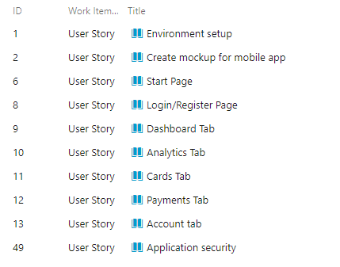
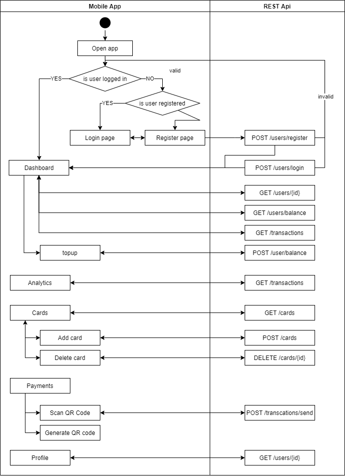

# Vanir - Procesul de dezvoltare software

## Descriere
Vanir este o aplicatie de mobile banking care permite utilizatorilor sa faca tranzactii usor si sigur. Aplicatia noastra permite incarcarea contului cu credit printr-o tranzactie cu un cont extern, istoricul tuturor tranzactiilor, analytics si punctul forte fiind tranzactiile intre utilizatorii aplicatiei care se realizeaza foarte usor prin scanarea unui cod QR.
In acest [link](https://www.youtube.com/watch?v=ky_Wi8Ko2lM&feature=youtu.be&fbclid=IwAR16hNKpcHUh5vZIgVCumjw_YopmTwm_kXSpMFYeVysQR58zZeB1FexuQlo&ab_channel=Vanir) puteti gasi prezentarea aplicatiei.

## User stories

## UML

## Source control

Am folosit `gitflow workflow` pentru organizarea branch-urilor in feature-uri.

In principiu pentru fiecare task am creat un feature cu numele taskului si dupa finalizarea sa am initiat un merge request in `develop`. Dupa testare aceste modificari au fost aduse in `master`.

## Teste automate

Am creat 5 teste automate dintre care 3 sunt pentru integrare si 2 unitare. Testele de integrare au vizat functionalitatea din controllere, iar testele unitare au verificat functiile utilitare folosite in layerul cu baza de date.

- [Integration tests](https://github.com/alexjilavu/vanir-backend/tree/master/src/test/java/com/jimaio/vanir/test/integration)
- [Unit tests](https://github.com/alexjilavu/vanir-backend/tree/master/src/test/java/com/jimaio/vanir/test/unit)

## Bug reporting

Am raportat bug-urile in  `AzureDevops` si am creat commituri pentru rezolvarea acestora.

- [Bug topup](https://github.com/alexjilavu/vanir-backend/commit/045fc5f4a1b4bb5f16de2dc21e4626186c0f9e06)
- [Bug page reload](https://github.com/alexjilavu/vanir-frontend/commit/53b86ffd3b8ff6802efe48b5642d0316d1b897fd)
- [Bug QR code](https://github.com/alexjilavu/vanir-frontend/commit/73cf764fac9ac4ba56edb42b8b633434703f4cf0)

## Folosirea unui build tool

Pentru partea de backend am folosit [Maven](https://github.com/alexjilavu/vanir-backend/blob/master/pom.xml).

## Refactoring, code standards

Codurile pentru backend si frontend respecta standardele Java, respectiv Flutter/Dart.

## Design patterns

Structura aplicatiei respecta standardele `Maven` si `Spring`, iar desing patternul folosit este `Domain Driven Design`
